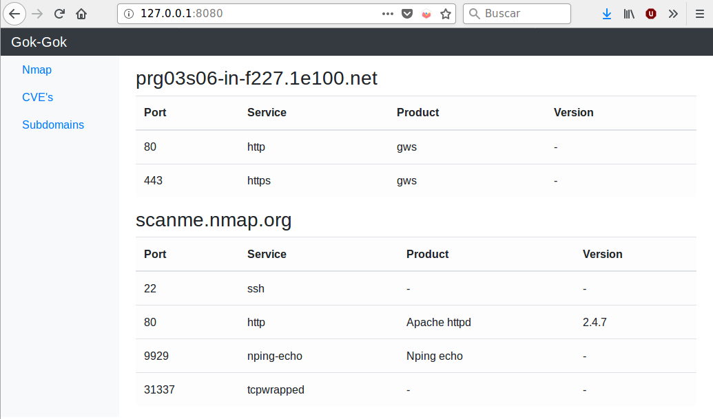
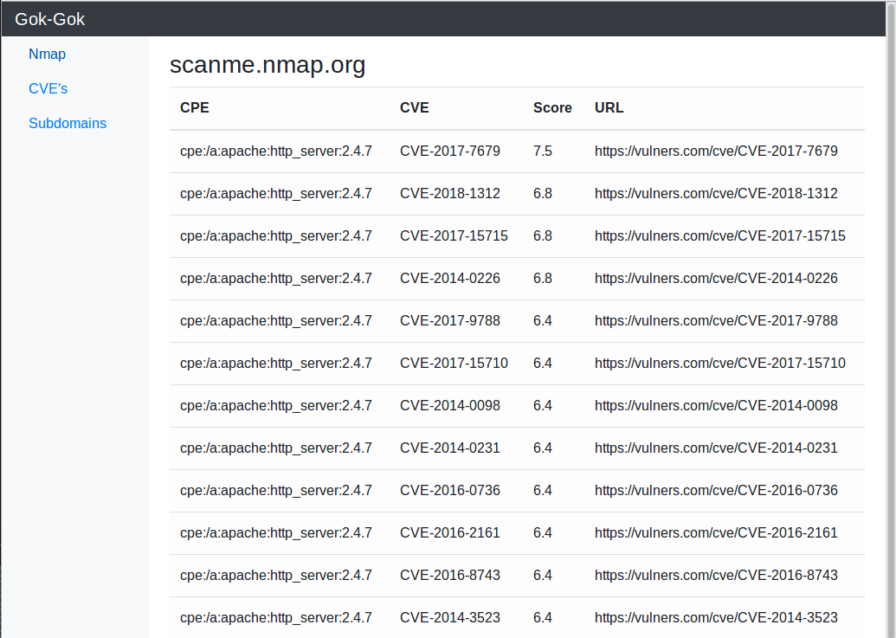

# GokGok
GokGok it's a tool for analyze and discover domains and subdomains. It uses passive methods for enumerate subdomains and it's written in Go.

## Requirements

+ Nmap from [Nmap Official Webpage](https://nmap.org/)
+ Vulners Nmap Script [Github](https://github.com/vulnersCom/nmap-vulners)

***

## Dependencies
```bash
github.com/fatih/color
github.com/integrii/flaggy
github.com/tomsteele/go-nmap
```
## Usage

```bash
➜  GokGok git:(dev) ✗ go run gokgok.go -h
Gok-Gok - Is something there?

  Flags:
    -h --help  Displays help with available flag, subcommand, and positional value parameters.
    -v --version  Print version
    -t --targetList  File with targets to be checked
    -d --domain  Domain is used with -d
    -sd --subdomains  Enumerate subdomains
    -s --scanThem  Scan the the targets with Nmap
    -p --parseFiles  Parse the nmap resut files, needs the path of the scans
    -o --html  HTML output
```

+ Check if hosts are up or down

```bash
➜  GokGok git:(dev) ✗  go run gokgok.go -t domainTest.txt
 [+] SUCCESS:  Host scanme.nmap.org is alive with 200 OK
 [+] SUCCESS:  Host google.com is alive with 200 OK
 [+] SUCCESS:  Host wikipedia.org is alive with 200 OK
 [-] ERROR:  No such host or it's down: icsdfsdfsd.es
 [-] ERROR:  No such host or it's down: werwerwer.com
```

+ Launch nmap over alive hosts (Scans will be saved in the nmapResults directory)

```bash
➜  GokGok git:(dev) ✗  go run gokgok.go -t domainTest.txt -s
 [+] SUCCESS:  Host scanme.nmap.org is alive with 200 OK
 [-] ERROR:  No such host or it's down: icsdfsdfsd.es
 [-] ERROR:  No such host or it's down: werwerwer.com
 [i] INFO:  Executing command nmap -sV -P0 45.33.32.156 -oX result_45.33.32.156.xml
 [+] SUCCESS:  Scan done
```

+ Parse nmap files

```bash
➜  GokGok git:(dev) ✗  go run gokgok.go -p nmapResults
 [i] INFO:  Host: scanme.nmap.org IP: 45.33.32.156
 [i] INFO:  Port: 22 Service: ssh Version: OpenSSH 6.6.1p1 Ubuntu 2ubuntu2.11
 [i] INFO:  Port: 80 Service: http Version: Apache httpd 2.4.7
 [i] INFO:  CVEs
  cpe:/a:apache:http_server:2.4.7:
        CVE-2017-7679           7.5             https://vulners.com/cve/CVE-2017-7679
        CVE-2014-0226           6.8             https://vulners.com/cve/CVE-2014-0226
        CVE-2018-1312           6.8             https://vulners.com/cve/CVE-2018-1312
        CVE-2017-15715          6.8             https://vulners.com/cve/CVE-2017-15715
        CVE-2017-9788           6.4             https://vulners.com/cve/CVE-2017-9788
        CVE-2016-8743           5.0             https://vulners.com/cve/CVE-2016-8743
        CVE-2014-3523           5.0             https://vulners.com/cve/CVE-2014-3523
        CVE-2014-0231           5.0             https://vulners.com/cve/CVE-2014-0231
        CVE-2014-0098           5.0             https://vulners.com/cve/CVE-2014-0098
        CVE-2017-15710          5.0             https://vulners.com/cve/CVE-2017-15710
        CVE-2016-0736           5.0             https://vulners.com/cve/CVE-2016-0736
        CVE-2013-6438           5.0             https://vulners.com/cve/CVE-2013-6438
        CVE-2016-2161           5.0             https://vulners.com/cve/CVE-2016-2161
        CVE-2017-9798           5.0             https://vulners.com/cve/CVE-2017-9798
        CVE-2016-4975           4.3             https://vulners.com/cve/CVE-2016-4975
        CVE-2014-0117           4.3             https://vulners.com/cve/CVE-2014-0117
        CVE-2014-8109           4.3             https://vulners.com/cve/CVE-2014-8109
        CVE-2015-3185           4.3             https://vulners.com/cve/CVE-2015-3185
        CVE-2014-0118           4.3             https://vulners.com/cve/CVE-2014-0118
        CVE-2018-1283           3.5             https://vulners.com/cve/CVE-2018-1283
        CVE-2016-8612           3.3             https://vulners.com/cve/CVE-2016-8612
 [i] INFO:  Port: 9929 Service: nping-echo Version: Nping echo
 [i] INFO:  Port: 31337 Service: ncat-chat Version: Ncat chat
```

+ Display the results

```bash
➜  GokGok git:(dev) ✗ go run gokgok.go -p nmapResults/ -o
 [i] INFO:  Host: prg03s06-in-f227.1e100.net IP: 172.217.23.227
 [i] INFO:  Port: 80 Service: http Version: gws
 [i] INFO:  Port: 443 Service: https Version: gws
 [i] INFO:  Host: scanme.nmap.org IP: 45.33.32.156
 [i] INFO:  Port: 22 Service: ssh Version:
 [i] INFO:  Port: 80 Service: http Version: Apache httpd 2.4.7
 [i] INFO:  CPE   cpe:/a:apache:http_server:2.4.7:
 [i] INFO:  CVE         CVE-2017-7679           7.5             https://vulners.com/cve/CVE-2017-7679
 [i] INFO:  CVE         CVE-2018-1312           6.8             https://vulners.com/cve/CVE-2018-1312
 [i] INFO:  CVE         CVE-2017-15715          6.8             https://vulners.com/cve/CVE-2017-15715
 [i] INFO:  CVE         CVE-2014-0226           6.8             https://vulners.com/cve/CVE-2014-0226
 [i] INFO:  CVE         CVE-2017-9788           6.4             https://vulners.com/cve/CVE-2017-9788
 [i] INFO:  CVE         CVE-2017-15710          5               https://vulners.com/cve/CVE-2017-15710
 [i] INFO:  CVE         CVE-2014-0098           5               https://vulners.com/cve/CVE-2014-0098
 [i] INFO:  CVE         CVE-2014-0231           5               https://vulners.com/cve/CVE-2014-0231
 [i] INFO:  CVE         CVE-2016-0736           5               https://vulners.com/cve/CVE-2016-0736
 [i] INFO:  CVE         CVE-2016-2161           5               https://vulners.com/cve/CVE-2016-2161
 [i] INFO:  CVE         CVE-2016-8743           5               https://vulners.com/cve/CVE-2016-8743
 [i] INFO:  CVE         CVE-2014-3523           5               https://vulners.com/cve/CVE-2014-3523
 [i] INFO:  CVE         CVE-2013-6438           5               https://vulners.com/cve/CVE-2013-6438
 [i] INFO:  CVE         CVE-2017-9798           5               https://vulners.com/cve/CVE-2017-9798
 [i] INFO:  CVE         CVE-2016-4975           4.3             https://vulners.com/cve/CVE-2016-4975
 [i] INFO:  CVE         CVE-2014-0117           4.3             https://vulners.com/cve/CVE-2014-0117
 [i] INFO:  CVE         CVE-2014-8109           4.3             https://vulners.com/cve/CVE-2014-8109
 [i] INFO:  CVE         CVE-2015-3185           4.3             https://vulners.com/cve/CVE-2015-3185
 [i] INFO:  CVE         CVE-2014-0118           4.3             https://vulners.com/cve/CVE-2014-0118
 [i] INFO:  CVE         CVE-2018-1283           3.5             https://vulners.com/cve/CVE-2018-1283
 [i] INFO:  CVE         CVE-2016-8612           3.3             https://vulners.com/cve/CVE-2016-8612
 [i] INFO:  Port: 9929 Service: nping-echo Version: Nping echo
 [i] INFO:  Port: 31337 Service: tcpwrapped Version:
2018/11/24 13:53:11  -  Listening on port 8080...
```



+ Enumerate subdomains

```bash
➜  GokGok git:(dev) ✗ go run gokgok.go -t domainTest.txt -sd
 [i] INFO:  Checking for subdomains
 [i] DOMAIN:  ikea.com
 [+] cert.sh: dexf.ikea.com
 [+] cert.sh: ww8.ikea.com
 [+] cert.sh: kitchenplanner.ikea.com
[...]
 [+] dnsdumpster: autodiscover.ikea.com
 [+] dnsdumpster: business.ikea.com
 [+] dnsdumpster: mail15.ikea.com

 [i] DOMAIN:  ford.com
 [+] cert.sh: racing.ford.com
 [+] cert.sh: bp3.ford.com
 [+] cert.sh: mymustang.ford.com
 [...]
 [+] dnsdumpster: fcnimports60.ford.com
 [+] dnsdumpster: lbbak3270.ford.com
 [+] dnsdumpster: pah140.ford.com
 ```

```bash
➜  GokGok git:(dev) ✗ go run gokgok.go -d ford.com -sd
 [i] INFO:  Checking for subdomains of ford.com
 [i] DOMAIN:  ford.com
 [+] cert.sh: mymustang.ford.com
 [+] cert.sh: buildfoc.ford.com
 [+] cert.sh: inventory.ford.com
 [...]
 [+] dnsdumpster: pah700.ford.com
 [+] dnsdumpster: pah740.ford.com
 [+] dnsdumpster: pah090.ford.com
```

## TODO

+ Display the results
+ Enumereate subdomains
